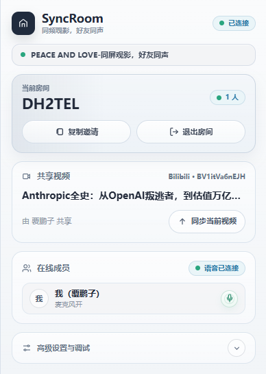

# syncRoom

[简体中文](./README.md) | English

> Watch together, speak in sync.

syncRoom is a browser extension, web room client, and WebSocket server for synchronized viewing. Users can create or join rooms, sync Bilibili pages, generic HTML5 `<video>` pages, or play server-resolved Bilibili DASH/HLS media in the web room through Shaka Player.

## Online Demo

Demo server URL:

```text
ws://8.163.88.33:8787
```

Use this server URL in the extension advanced settings or the web room entry screen to connect to the demo server.



## Core Capabilities

| Capability              | Summary                                                                                               | Details                                                             |
| ----------------------- | ----------------------------------------------------------------------------------------------------- | ------------------------------------------------------------------- |
| Browser extension sync  | Sync Bilibili and generic HTML5 video pages in Chrome, Edge, and Firefox 121+                         | [Quick start](#quick-start)                                         |
| Web room                | Standalone web client with room info, player, chat, settings, and authorization management            | [Web room feature guide](./docs/features/web-room.md)               |
| Bilibili proxy playback | Host QR authorization, server-side DASH/HLS parsing, and explicit `proxy/shared` playback policy      | [Proxy operations](./docs/operations/web-room-bilibili-proxy.md)    |
| Room chat and danmaku   | Text chat, private room danmaku, and system messages are real-time and not persisted                  | [Web room feature guide](./docs/features/web-room.md)               |
| LiveKit voice           | Optional self-hosted LiveKit; members can listen by default and the mic stays muted until user action | [Voice operations](./docs/operations/livekit-voice-chat.md)         |
| Admin panel             | Rooms, events, audit logs, config summary, blacklist, and runtime limits                              | [Server operations](./docs/operations/server-operations.md)         |
| Multi-node deployment   | Redis-backed room state, runtime indexes, event streams, audit streams, and admin commands            | [Multi-node runbook](./docs/runbook/multi-node-operations.zh-CN.md) |

## Quick Start

### Install and build

```bash
npm install
npm run build
```

### Start the local server

For development, add the current extension or web-room origin to `ALLOWED_ORIGINS`.

PowerShell:

```powershell
$env:ALLOWED_ORIGINS="chrome-extension://<extension-id>,http://localhost:4173"
npm run dev:server
```

Bash:

```bash
ALLOWED_ORIGINS=chrome-extension://<extension-id>,http://localhost:4173 \
npm run dev:server
```

See [server operations](./docs/operations/server-operations.md) for environment variables, Admin, Redis, reverse proxy, and production notes.

### Load the extension

Chrome / Edge:

1. Open `chrome://extensions`
2. Enable Developer mode
3. Click `Load unpacked`
4. Select `extension/dist`

Firefox 121+:

```bash
npm run build:extension:firefox
```

Then load `extension/dist-firefox/manifest.json` from `about:debugging#/runtime/this-firefox`.

### Use the web room

The web room source lives in `apps/web-room/`. It is not a separate Node backend service; it builds to static files under `apps/web-room/dist/`. Host that directory with a static file server, then point the web entry screen at the same syncRoom server.

```bash
npm --workspace @syncroom/web-room run build
```

Local example:

```bash
npx serve apps/web-room/dist -l 4173
```

Then open `http://localhost:4173`, use the default `ws://localhost:8787` server URL, and make sure the server `ALLOWED_ORIGINS` includes `http://localhost:4173`.

See [web room features](./docs/features/web-room.md) for the player, Bilibili authorization, proxy playback, chat, danmaku, and voice boundaries.

## Documentation Map

The README is the project entry and quick path. Full parameters, operations strategy, and extended feature notes live under `docs/` so they are versioned and reviewed with code. GitHub Wiki can mirror released docs or serve as a user portal, but it should not be the only source of truth for this repository.

| Topic                              | Document                                                                                     |
| ---------------------------------- | -------------------------------------------------------------------------------------------- |
| Documentation index                | [docs/README.md](./docs/README.md)                                                           |
| Web room feature guide             | [docs/features/web-room.md](./docs/features/web-room.md)                                     |
| Server and deployment operations   | [docs/operations/server-operations.md](./docs/operations/server-operations.md)               |
| Web room Bilibili proxy operations | [docs/operations/web-room-bilibili-proxy.md](./docs/operations/web-room-bilibili-proxy.md)   |
| LiveKit voice operations           | [docs/operations/livekit-voice-chat.md](./docs/operations/livekit-voice-chat.md)             |
| Multi-node runbook                 | [docs/runbook/multi-node-operations.zh-CN.md](./docs/runbook/multi-node-operations.zh-CN.md) |
| Privacy policy                     | [docs/legal/privacy.md](./docs/legal/privacy.md)                                             |
| Contribution rules                 | [CONTRIBUTING.md](./CONTRIBUTING.md)                                                         |

## Project Structure

```text
syncRoom/
  apps/web-room/       Web room client
  extension/           Chrome, Edge, and Firefox browser extension
  server/              WebSocket room server and Admin
  packages/protocol/   Shared protocol types, guards, and URL normalization
  docs/                Feature, operations, migration, and policy docs
  scripts/             Build, release, and audit scripts
```

The display name is `syncRoom`; package names, environment variables, Prometheus metrics, storage keys, and internal channels use `syncroom` / `@syncroom/*` / `SYNCROOM_*`.

## Development Commands

```bash
npm run lint
npm run format:check
npm run typecheck
npm run build
npm test
```

See [server operations](./docs/operations/server-operations.md) and [CONTRIBUTING.md](./CONTRIBUTING.md) for command details, audit gates, and release workflow.
