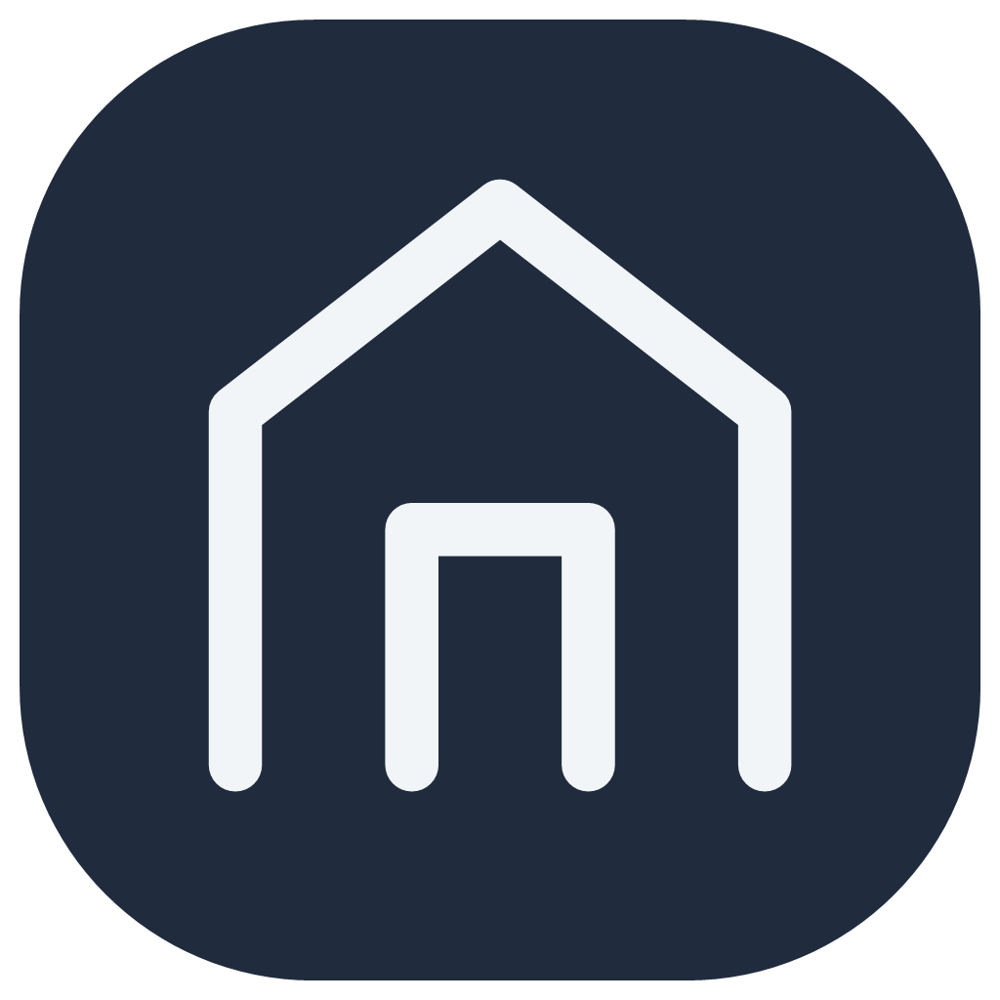
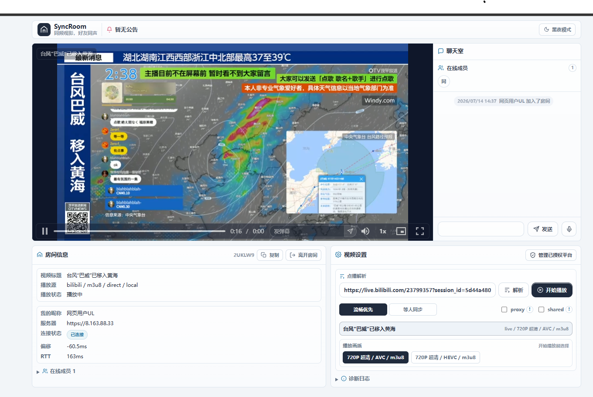

<div align="center">
  
  <h1>syncRoom</h1>
  <h3>同频观影，好友同声。</h3>
  <p>和朋友进入同一个网页房间，同步观看直播、视频与电影。</p>
  <p>简体中文 | <a href="./README.en.md">English</a></p>
</div>

syncRoom 是一个面向多人同步观影的网页房间、浏览器扩展和 WebSocket 服务端。网页房间无需安装扩展，打开页面即可创建或加入房间，在同一个界面中完成视频解析、清晰度选择、同步播放、聊天、弹幕、语音和成员管理。

## 网页房间

<p align="center">
  
</p>

<p align="center">网页房间中的直播播放器、聊天室、成员列表、房间信息与视频设置</p>

网页房间是 syncRoom 的主要使用入口，适合不想安装扩展、希望直接通过浏览器一起观看内容的用户。

- **同步观看**：支持流畅优先和等人同步两种策略，同步播放、暂停、跳转、倍速与播放进度。
- **直播、视频与电影**：可播放直播流、普通视频、番剧和电影，并提供清晰度与编码候选选择。
- **平台解析与授权**：房主粘贴平台链接即可解析；需要登录态时可通过 QR 临时授权，授权凭据不会下发给房间成员。
- **proxy / shared 策略**：可在服务端代理播放与客户端直连之间选择，并控制是否使用房主授权解析内容。
- **房间互动**：提供文字聊天、房间私有弹幕、成员状态、系统消息和可选 LiveKit 语音。
- **跨客户端加入**：网页端与浏览器扩展复用同一套房间协议，双方重叠的房间与播放同步能力可以共同使用。

完整说明见 [网页房间功能](./docs/features/web-room.zh-CN.md)。

## 支持的内容平台

| 平台或来源      | 支持内容               | 网页房间能力                                                                 |
| --------------- | ---------------------- | ---------------------------------------------------------------------------- |
| Bilibili        | 视频、番剧、电影、直播 | 页面链接解析、QR 临时授权、清晰度选择、DASH/HLS、`proxy` / `shared` 播放策略 |
| 爱奇艺 / iQIYI  | 视频、电影             | 页面链接解析、QR 临时授权和可播放媒体候选                                    |
| 虎牙 / Huya     | 直播                   | 公开直播解析、QR 临时授权、FLV 直播与清晰度候选                              |
| 通用 HTML5 媒体 | 公开视频和媒体直链     | 通用页面解析，以及 MP4、DASH/MPD、HLS/m3u8、FLV/TS 等浏览器可播放媒体格式    |

通用媒体能否直接播放还会受到目标站点的 CORS、防盗链、链接有效期以及浏览器编解码能力影响；遇到受限内容时可使用平台授权或 `proxy` 模式。

## 客户端支持

| 客户端     | 支持平台                   | 适用方式                                                       |
| ---------- | -------------------------- | -------------------------------------------------------------- |
| 网页房间   | 现代桌面和移动浏览器       | 无需安装扩展，通过网页创建或加入房间；实际解码能力取决于浏览器 |
| 浏览器扩展 | Chrome、Edge、Firefox 121+ | 从 Bilibili 或带标准 HTML5 `<video>` 的当前网页直接发起同步    |

网页房间负责完整的观影工作台；浏览器扩展更适合直接同步当前标签页中的视频。Safari 和移动端浏览器使用网页房间，不在浏览器扩展的支持范围内。

## 在线体验

体验服务端地址：

```text
ws://8.163.88.33:8787
```

在扩展的高级设置或网页房间入口中把服务器地址切换为上方地址即可连接体验服务端。

## Docker 镜像

镜像已发布到 Docker Hub 仓库 `benxl/syncroom-server`，其中 `benxl` 是 Docker Hub 用户名/命名空间。下载当前版本镜像：

```bash
docker pull benxl/syncroom-server:1.0.3
```

服务端、网页房间、Nginx、Redis、LiveKit 和媒体解析服务可以作为单镜像运行：

```bash
docker run --rm --name syncroom \
  -p 8787:8787 \
  -p 7881:7881 \
  -p 50000-60000:50000-60000/udp \
  benxl/syncroom-server:1.0.3
```

网页房间入口为 `http://localhost:8787/room/`，扩展或网页房间中的服务端地址填写 `ws://localhost:8787`。生产部署时应显式设置 `ALLOWED_ORIGINS`、Admin 密钥和 `LIVEKIT_URL`；完整环境变量和外层 TLS 反代说明见 [Docker 单镜像部署](./docs/operations/docker-single-image.zh-CN.md)。

## 其他项目能力

| 能力              | 简述                                                                              | 详细文档                                                           |
| ----------------- | --------------------------------------------------------------------------------- | ------------------------------------------------------------------ |
| Bilibili 代理播放 | 房主通过 QR 临时授权，服务端解析 DASH/HLS，并可用 `proxy/shared` 策略控制播放方式 | [代理播放运维](./docs/operations/web-room-bilibili-proxy.zh-CN.md) |
| LiveKit 语音      | 可选自建 LiveKit；成员默认可听，麦克风默认关闭，用户主动开麦后才请求权限          | [语音运维](./docs/operations/livekit-voice-chat.md)                |
| 管理后台          | 房间、事件、审计、配置摘要、黑名单和运行限制管理                                  | [服务端运维](./docs/operations/server-operations.zh-CN.md)         |
| 多节点部署        | Redis 可承载房间状态、运行时索引、事件流、审计流和管理命令                        | [多节点 Runbook](./docs/runbook/multi-node-operations.zh-CN.md)    |

### 浏览器扩展界面


## 快速开始

### 安装并构建

```bash
npm install
npm run build
```

### 启动本地服务端

开发时需要把当前扩展或网页房间 Origin 加入 `ALLOWED_ORIGINS`。

PowerShell：

```powershell
$env:ALLOWED_ORIGINS="chrome-extension://<extension-id>,http://localhost:4173"
npm run dev:server
```

Bash：

```bash
ALLOWED_ORIGINS=chrome-extension://<extension-id>,http://localhost:4173 \
npm run dev:server
```

更多环境变量、Admin、Redis、反向代理和生产部署注意事项见 [服务端运维](./docs/operations/server-operations.zh-CN.md)。

### 加载扩展

Chrome / Edge：

1. 打开 `chrome://extensions`
2. 开启开发者模式
3. 点击 `加载已解压的扩展程序`
4. 选择 `extension/dist`

Firefox 121+：

```bash
npm run build:extension:firefox
```

然后在 `about:debugging#/runtime/this-firefox` 中临时加载 `extension/dist-firefox/manifest.json`。

### 使用网页房间

网页房间源码位于 `apps/web-room/`，不是单独的 Node 后端服务。它会构建成 `apps/web-room/dist/` 静态文件；本地或生产环境都需要用静态文件服务托管该目录，再把网页入口中的服务器地址指向同一个 syncRoom server。

```bash
npm --workspace @syncroom/web-room run build
```

本地示例：

```bash
npx serve apps/web-room/dist -l 4173
```

随后访问 `http://localhost:4173`，服务器地址填写默认的 `ws://localhost:8787`，并确保 server 的 `ALLOWED_ORIGINS` 包含 `http://localhost:4173`。

Web Room 的播放器、平台授权、代理播放、聊天室、弹幕和语音边界见 [网页房间功能](./docs/features/web-room.zh-CN.md)。

## 文档地图

README 只保留项目入口和关键路径；完整参数、运维策略和扩展说明维护在 `docs/` 内，并随代码一起走 PR 审查。GitHub Wiki 可以作为发布后的镜像或面向用户的门户，但不建议作为此项目的唯一主文档源。

| 主题                           | 文档                                                                                                   |
| ------------------------------ | ------------------------------------------------------------------------------------------------------ |
| 文档总索引                     | [docs/README.md](./docs/README.md)                                                                     |
| 网页房间功能说明               | [docs/features/web-room.zh-CN.md](./docs/features/web-room.zh-CN.md)                                   |
| 服务端与部署运维               | [docs/operations/server-operations.zh-CN.md](./docs/operations/server-operations.zh-CN.md)             |
| 网页房间 Bilibili 代理播放运维 | [docs/operations/web-room-bilibili-proxy.zh-CN.md](./docs/operations/web-room-bilibili-proxy.zh-CN.md) |
| LiveKit 语音运维               | [docs/operations/livekit-voice-chat.md](./docs/operations/livekit-voice-chat.md)                       |
| 多节点运行手册                 | [docs/runbook/multi-node-operations.zh-CN.md](./docs/runbook/multi-node-operations.zh-CN.md)           |
| 隐私权政策                     | [docs/legal/privacy.zh-CN.md](./docs/legal/privacy.zh-CN.md)                                           |
| 贡献规则                       | [CONTRIBUTING.md](./CONTRIBUTING.md)                                                                   |

## 项目结构

```text
syncRoom/
  apps/web-room/       网页房间客户端
  extension/           Chrome、Edge、Firefox 浏览器扩展
  server/              WebSocket 房间服务端和 Admin
  packages/protocol/   共享协议类型、校验和 URL 规范化
  docs/                功能、运维、迁移和政策文档
  scripts/             构建、发布和审计脚本
```

展示名统一为 `syncRoom`；包名、环境变量、Prometheus 指标、存储 key 和内部通道使用 `syncroom` / `@syncroom/*` / `SYNCROOM_*`。

## 开发命令

```bash
npm run lint
npm run format:check
npm run typecheck
npm run build
npm test
```

常用命令、审计门禁和发布流程见 [服务端运维](./docs/operations/server-operations.zh-CN.md) 与 [CONTRIBUTING.md](./CONTRIBUTING.md)。
